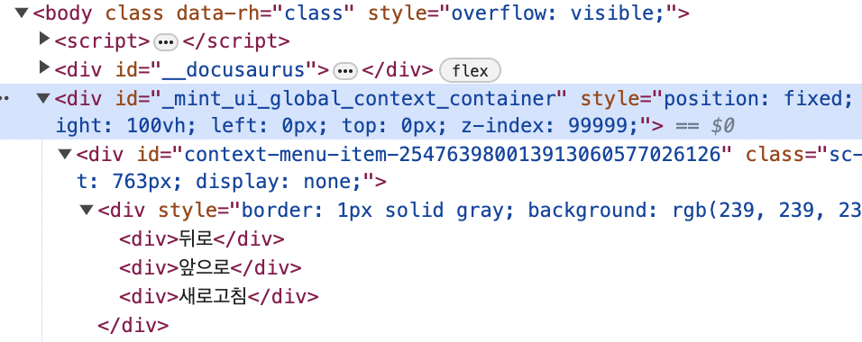

import { ContextMenuBasic } from '@site/src/components/examples/ContextMenus'

# ContextMenu

원하는 위치에 특정 엘레먼트를 렌더링할 수 있게 해주는 hook 입니다.  다른 컴포넌트와 다르게 사용 편의상 hook 으로 개발되었습니다.

[Autocomplete](./component-autocomplete.mdx) 이나 [Dropdown](./component-dropdown.mdx) 도 내부적으로는 useContextMenu 를 사용하고 있습니다.

```javascript
export function ContextMenuBasic(){

  const { contextElement, show } = useContextMenu(
  <div style={{border:'1px solid gray', background:'#efefef', padding:'10px 15px'}}>
    <div>뒤로</div>
    <div>앞으로</div>
    <div>새로고침</div>
  </div>)

  return <Frame>
    {contextElement} {/* useContextMenu 를 통해 얻은 element 를 삽입 */}
    <Flex flexHeight="300px" flexAlign="center" 
    style={{border:'1px solid gray'}}
    onContextMenu={(e)=>{
      e.preventDefault();
      show(`${e.clientX}px`, `${e.clientY}px`);
    }}>
      여기서 우클릭하면 ContextMenu 가 뜹니다.
    </Flex>
  </Frame>
}
```

<ContextMenuBasic />

## 렌더링 구조
ContextMenu 는 일반적인 컴포넌트와는 다르게 react-dom 의 createPortal 을 통해 body 하위의 일정 위치에 렌더링 됩니다.

여러개의 ContextMenu가 생성되어도 같은 컨테이너 하위에 모이게 됩니다.



> 이렇게 되면 별도의 Context API 를 사용하지 않아도 현재 document 의 모든 ContextMenu 의 제어가 가능해집니다.
특정 Context API 스펙 없이 구현하는것을 목표로 한 결과입니다.

## hook 파라미터

### element
```javascript
element = ReactNode
```

컨텍스트메뉴 위치에 렌더링될 엘레먼트입니다.

### (optional) zIndex
```javascript
zIndex = number
```

ContextMenu 가 모이는 컨테이너 내에서의 zIndex 를 설정합니다. ContextMenu 간의 깊이를 조정해야 할 때 쓸 수 있습니다.

### (optional) independant
```javascript
independant = boolean
```

이 값이 true 이면 이 ContextMenu 가 보여질때(show 처리) 기본 ContextMenu 의 전부 닫힘 처리를 하지 않습니다.
>보통은 자신이 보여질때 모든 ContextMenu 를 닫은 후 자신이 보여지는 처리를 합니다.

## hook 리턴 설명

### contextElement
```javascript
contextElement = React.ReactPortal
```

입력받은 element 를 ContextMenu 컨테이너에 createPortal 한 결과입니다. 이 값을 렌더링에 사용할 수 있습니다.

```javascript
export function ContextMenuBasic(){

  const { contextElement, show } = useContextMenu(
  <div style={{border:'1px solid gray', background:'#efefef', padding:'10px 15px'}}>
    <div>뒤로</div>
    <div>앞으로</div>
    <div>새로고침</div>
  </div>)

  ...

  return <Frame>
    {contextElement} {/* useContextMenu 를 통해 얻은 element 를 삽입 */}
    ...
  </Frame>
}
```

### show
```javascript
show = (left: string, top: string, noAutoRepositioning?: boolean, marginLeft?: number, margintTop?: number) => void

show(`300px`, `100px`);
show(`calc(50% - 50px)`, `calc(50% - 50px)`);
```

ContextMenu 를 원하는 위치에 보여지게 합니다. 이미 보여지고 있던 다른 ContextMenu 는 전부 닫힙니다.

파라미터 설명은 다음과 같습니다.

|파라미터|타입|설명|
|---|---|---|
|left|string|화면상의 left 좌표입니다. 예) 300px|
|top|string|화면상의 top 좌표입니다. 예) 100px|
|noAutoRepositioning|(optional) boolean|기본적으로 ContextMenu 는 표시했을때 컨텐츠가 잘리는지 여부를 계산해서 잘리는 경우 그 축을 기준으로 자동 반전 시킵니다. 이 속성을 false 로 주면 이 처리를 하지 않습니다.|
|marginLeft|(optional) number|left의 위치에서 주어진 값 만큼 더 보정을 할 수 있습니다.|
|margintTop|(optional) number|top의 위치에서 주어진 값 만큼 더 보정을 할 수 있습니다.|

### hide
```javascript
hide = () => void
```

해당 ContextMenu 를 숨깁니다.

### getShowState
```javascript
getShowState = () => boolean
```

현재 ContextMenu 가 보여지는 상태인지를 리턴합니다. show / hide 상태를 체크할 필요가 있을때 사용할 수 있습니다.